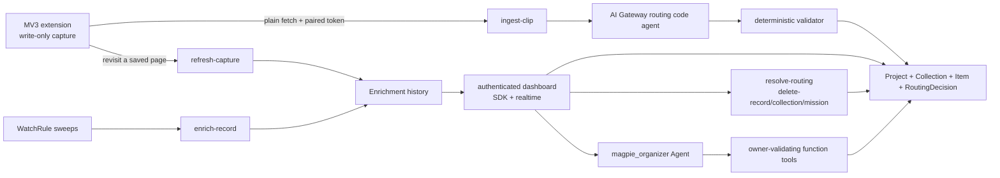

# Magpie

**Clip the web. Turn scattered evidence into structured information that stays
useful.**

Magpie is a Chrome MV3 extension, Base44 backend, and realtime dashboard.
Capture a product, listing, job, recipe, article, place, or vendor. Magpie
preserves the evidence, understands the object type, organizes it into a
reusable Collection, extracts comparable fields, routes uncertainty to you
instead of guessing, and keeps source-backed fields current — even behind
login walls, by piggybacking on your own browsing.

**Public app URL after Base44 custom-domain connection:** <https://magpiecapture.com>

## Documentation

| Read this | If you want to |
|---|---|
| [**Getting Started**](docs/GETTING_STARTED.md) | Sign in, install the unpacked extension, pair it, and make your first capture in ~5 minutes |
| [**Product Guide**](docs/PRODUCT_GUIDE.md) | Understand every feature: capture modes, auto-organization, review, watches, refresh-on-revisit, Ask Magpie, and the trust model |
| [**API Reference**](docs/API.md) | Call the backend: both principals, every endpoint, typed outcomes, and reason codes |
| [**Project Write-up**](docs/PROJECT_WRITEUP.md) | Submission-form summary, decisions defended, what I got wrong, and what's not done |
| [Product Charter](docs/PRODUCT_CHARTER.md) | The authoritative product intent and boundaries |
| [docs/README.md](docs/README.md) | The full internal documentation map |

## Product loop

```text
capture -> understand -> organize -> review -> compare -> refresh
```

- **Project:** optional purpose, such as "Buy a camera" or "Move to Berlin."
- **Collection:** reusable object type and schema.
- **Item:** one structured Record inside a Collection.
- **Capture:** source evidence behind an Item.
- **Update:** a trusted source-backed field change.

## Architecture



AI proposes; deterministic code decides. The capture routing agent suggests
Project and Collection placement; server code validates every proposal and
owns every write. The `magpie_organizer` Agent is the user-facing intelligence
layer — bounded owner context, comparisons, routing explanations, and watch
management through four backend tools, with no direct entity access and no
memory.

## MV3 trust boundary

The extension does **not** import `@base44/sdk`. It stores an opaque paired
token in `chrome.storage.local` and submits bounded evidence through plain
`fetch`. It can submit captures and refreshes and receive safe status; it
cannot read Projects, Collections, Items, Captures, routing decisions,
updates, watches, or Agent conversations. Its refresh-on-revisit memory is a
local list of URLs it itself captured — the server never sends owner data to
the extension.

## Backend coverage

| Surface | Load-bearing use |
|---|---|
| Database and entities | `Mission`, `Collection`, `Record`, `Clip`, `RoutingDecision`, `Enrichment`, `WatchRule`, `RefreshAttempt`, `ExtensionInstall` |
| Backend functions | 24 in `base44/functions/` locally: pairing create/context/list/revoke, Project and saved-search creation, ingestion, routing/retry/undo, audited field correction, cascade deletion (Item/Collection/Project), refresh, enrichment, sweeps, bug reporting, and four Agent tools. The redesign and three pairing-management functions are local pending deploy. |
| AI Gateway | Bounded Project/Collection routing proposals and multimodal extraction (snipped screenshots route visually) |
| Configured Agent | Workspace understanding, comparison, routing explanation, and watch management with markdown replies |
| Realtime | Live Collection, Item, Capture, RoutingDecision, Update, and Watch subscriptions |
| File storage | Browser-captured screenshot and snip evidence |
| Auth and RLS | Google dashboard identity, separate hashed extension pairing, owner isolation on every row |
| Deployment | Linked Base44 app, targeted function releases, Agent sync, hosted Vite site |

## Current status

Deployed in production (code confirmed live via `deploy-base44.yml` GitHub
Actions run history as of 2026-08-16; see `docs/BETA_LIMITATIONS.md` for
per-feature verification status — deployed code and manually-verified UX are
tracked separately, not conflated):

- six capture modes including a drag-to-snip visual tool, with
  layout-independent keyboard shortcuts and status-aware toasts;
- existing/new/review automatic routing with semantic Project assignment and
  capture-time duplicate detection (`content_hash`);
- a Needs-review workflow: accept / move / create (with inline Project
  creation) / dismiss, deep-linked from capture toasts;
- permanent Item, Collection, and Project deletion, each a full server-owned
  cascade over everything scoped beneath it, including a 2026-08-14 fix for
  cascades past 200+ child rows (B13);
- watches with exponential backoff, auto-pause after three blocked checks, and
  refresh-on-revisit that heals blocked Items from the owner's own browser;
- the authenticated `magpie_organizer` Agent with four owner-validating tools;
- a static CSS-3D landing page and a realtime dashboard with review, deletion,
  monitoring, and comparison surfaces.

Some of the above have documented live production checks (RLS owner
isolation, `refresh-capture`'s browser-token healing path, `delete-record`/
`resolve-routing` auth and 404 behavior); others are deployed but have not
had a manual sign-in click-through since their latest change (notably
Collection/Project deletion and the onboarding checklist). See
`docs/BETA_LIMITATIONS.md` for the claim-by-claim breakdown.

The 2026-08-24 redesign is implemented locally and not deployed. It renames
review to Nest, adds the Library/Signals/Search shell, persists live searches
as routing-ineligible `saved_search` Collections, records a real pairing
handshake, adds Connected Browsers list/revoke/reconnect lifecycle management,
adds a short owner-only route undo, and makes tablet field
correction an audited server write. These require the entity/function/site
deployment set listed in `docs/V3_1_PRODUCT_AND_RISK_PLAN.md`; push
notifications remain deliberately unbuilt pending a separate VAPID and
subscription-lifecycle design.

Release gates (re-run locally 2026-08-24): 255/255 Deno tests; all 24 backend entry
points type-check; the production build passes; extension scripts parse; no
extension SDK import; live smoke tests documented in
`docs/CLAUDE_CODE_HANDOFF.md` cover authentication, typed 404s, the original
deletion-cascade smoke checks, and a real browser-token refresh that updated
a blocked Item end to end (2026-07-25, not re-run by this audit).

## Local development

```powershell
npm install
npx.cmd base44 whoami
npx.cmd base44 dev
```

Load `extension/` through `chrome://extensions` as an unpacked extension —
full steps in [Getting Started](docs/GETTING_STARTED.md).

## Verify

```powershell
$magpieDeno = "$env:USERPROFILE\.deno\bin\deno.exe"
& $magpieDeno test --allow-env --allow-read tests

$entryFiles = (Get-ChildItem -Path base44\functions -Filter entry.ts -Recurse).FullName
& $magpieDeno check $entryFiles

npm.cmd run build
rg -n "@base44/sdk" extension
```

The last command must return no matches. Do not deploy without explicit
approval; `npx base44 agents push` synchronizes the complete local Agent
directory.

## Repository map

```text
base44/entities/        Owner-scoped Base44 schemas
base44/functions/       24 backend functions (pairing lifecycle, ingest, routing/review/undo, saved search, correction, deletion, refresh, bug reports, Agent tools)
base44/shared/          Deterministic validation and reusable backend logic
extension/              MV3 picker, snip tool, worker, and pairing side panel
src/                    Landing page and realtime dashboard
tests/                  255 pure Deno fixtures
docs/                   User docs, API reference, charter, and engineering history
```

The original V1 README is preserved at
[docs/README_V1_ARCHIVE.md](docs/README_V1_ARCHIVE.md).
