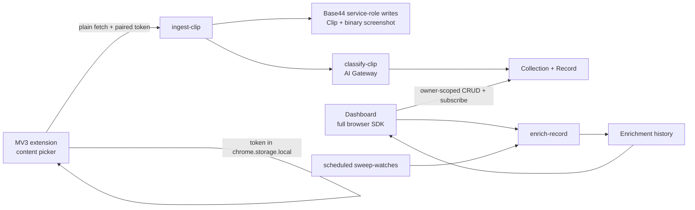

# Magpie V1 README (archived)

**Clip apartment listings. Keep your decision current.**

Apartment hunting breaks when listings, prices, and availability change after you save them. Magpie turns captures into one living shortlist: clip a listing, preserve its source context, compare its visible facts, and keep meaningful changes attached to the candidate. Generic web clipping remains the capture capability, but apartment hunting is the intentional V1 product.

## Demo path

1. Create **Find a 2-bedroom in Tel Aviv under ₪9,000** in the dashboard.
2. Open three apartment listings, press `Alt+Shift+M`, hover a listing card, then press `C`.
3. Each capture appears live in that Mission's shortlist with rent, area, bedrooms, size, and availability.
4. Shortlist one candidate, mark one as contacted, and use **Check source now** to demonstrate a source-backed change.

## Architecture



The extension **does not import `@base44/sdk`**. It stores only its paired token in `chrome.storage.local` and sends a bounded payload to `ingest-clip` via `fetch`. Every entity write happens inside a Base44 backend function using `asServiceRole`. The normal dashboard runs the SDK and its realtime subscriptions in a browser page, where storage and sockets are reliable.

## Why this needs a backend

A browser extension is not a backend. `chrome.storage` cannot run agents, perform owner-scoped database writes, host realtime subscriptions, securely store service credentials, or revisit a source after the extension closes. Magpie uses Base44 functions for the untrusted extension boundary, persistent entities for the library, the AI gateway for classification, and realtime events for the visual payoff.

## Backend coverage

| Surface | Where Magpie uses it |
|---|---|
| Database & entities | `Clip`, `Collection`, `Record`, `Enrichment`, `WatchRule`, and `ExtensionInstall` are the product’s durable model. |
| Backend functions | `create-extension-pairing`, `ingest-clip`, `classify-clip`, `enrich-record`, and `sweep-watches` own pairing, validation, writes, classification, and recurring checks. |
| AI gateway | `classify-clip` makes a bounded OpenAI-compatible call through `base44.asServiceRole.aiGateway` to infer the collection shape and fields. |
| Realtime sync | The dashboard subscribes to `Collection`, `Record`, `Clip`, and `Enrichment`; new structured rows appear without a reload. |
| File storage | The MV3 worker captures a JPEG viewport. `ingest-clip` converts it to a `File` and persists it in the binary `Clip.screenshot` field. |
| Auth & identity | Dashboard users sign in with Google. The dashboard mints a separate opaque browser-pairing token, while only its hash is persisted. |
| Permissions & RLS | Every entity has owner-scoped reads and admin service-write rules. The ingest function only accepts an extension principal paired to that owner. |
| Deployment | `base44/config.jsonc` defines the Vite build and output for `npx base44 deploy`. |

Google Sheets/Notion export is deliberately not included yet; it would be connector-shaped surface area without strengthening the capture-to-live-row demo. See [`DECISIONS.md`](DECISIONS.md).

## The RLS trust boundary

Magpie treats the dashboard and the shipped extension as different principals:

| Principal | Can | Cannot |
|---|---|---|
| Paired extension token | Invoke `ingest-clip` to create clips for its paired owner | Read `Record`, `Collection`, `Clip`, or `Enrichment`; choose a different owner |
| Dashboard user | Read and manage only rows whose `owner_id` matches their Base44 user ID | Read cross-owner data |
| Backend service role | Perform the validated writes required by the product | Bypass its explicit admin-inclusive RLS rules |

Click **Pair extension** in the dashboard to mint a random `mp_…` browser token. Magpie stores only its SHA-256 hash in `ExtensionInstall` alongside the dashboard owner ID. `ingest-clip` resolves that owner server-side. If someone extracts the extension token, they can at most submit clips into that token’s paired library; they learn nothing from the data model. The extension never receives a collection or record response.

## MV3 finding

`@base44/sdk@0.8.40` is appropriate for the dashboard but not for an MV3 service worker. Its token-persistence paths are guarded around `window`, which a service worker does not have; an idle MV3 worker can be terminated and lose an in-memory token. One path also reaches `window.localStorage`. The symptom is especially dangerous because an initial call can succeed and a later worker wake can silently become anonymous.

This is why `extension/service-worker.js` contains no SDK import. It uses `fetch` and durable Chrome storage only. The detailed note is in [`ENGINEERING_NOTES.md`](ENGINEERING_NOTES.md).

## Quickstart

### Prerequisites

- Node.js 20+
- A Base44 account with this project linked

### Develop

```bash
npm install
npm run build
npx base44 types generate
npx base44 deploy
```

Open the deployed dashboard, sign in with Google, and click **Pair extension**. Copy the one-time URL and token shown in the dialog. Then load `extension/` as an unpacked extension in Chrome. In the extension’s **Connection settings**, enter:

- the copied ingest function URL
- the copied browser-pairing token

The full checkpointed build process is in [`BUILD_GUIDE.md`](BUILD_GUIDE.md).

Product direction is anchored in [`PRODUCT_CHARTER.md`](PRODUCT_CHARTER.md). The automatic-organization roadmap and separate-task handoff are in [`V3_AUTO_ORGANIZATION_PLAN.md`](V3_AUTO_ORGANIZATION_PLAN.md).

## Repository map

```text
base44/entities/        Owner-scoped Base44 schemas
base44/functions/       Ingest, classification, enrichment, and sweep functions
base44/shared/          Validation and reusable backend helpers
extension/              MV3 picker, worker, and pairing configuration UI
src/                    Realtime dashboard
docs/                   Build guide, engineering notes, and scoped decisions
```
